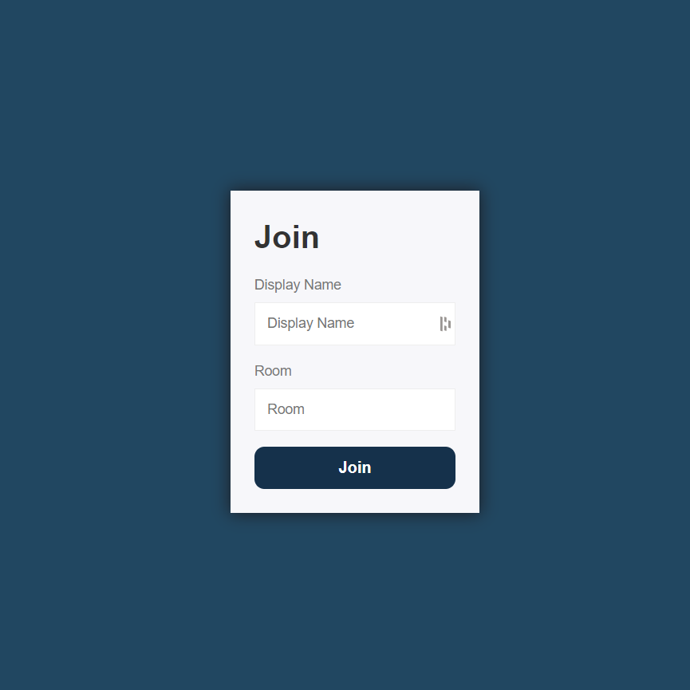
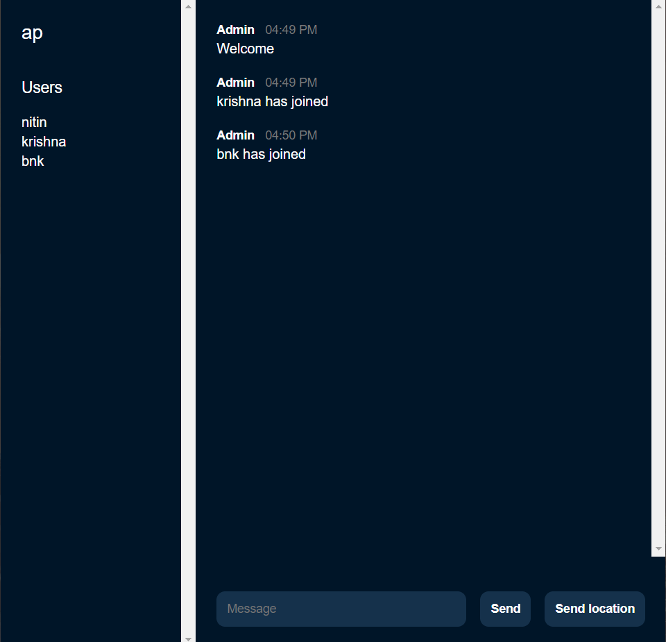

# chat-app
A Realtime Chatting App built using Node.JS and Socket.io

## Login Page
Users will be asked to enter their username and join a specific room on booting the app. 
The Following Validations and Modifications are performed:
- No two users with the same name can exist in a room. Users trying to do so will not be allowed to login.
- Both the Username and Room Name are trimmed of trailing and leading whitespaces (if any) and are turned into their lowercase counterpart so as to remove the distinction between uppercase and lowercase variation of the same name (eg:- Nitin and nitin)

</img>

## Chat Page
The name of the room is displayed at the top-left corner. Just below that are the users in the room. The current user is notified when other users join the room.

</img>
